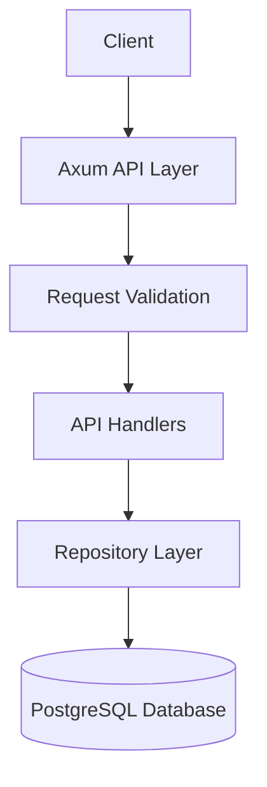
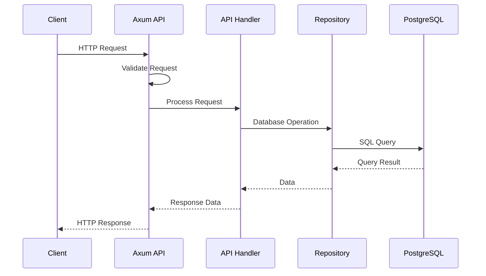

# Product Catalog REST API Architecture Plan

This document outlines the architecture and implementation plan for a Product Catalog REST API using Rust, Axum, and PostgreSQL.

## Project Overview

The project will create a RESTful API for managing product catalog data with basic CRUD operations for products with fields such as name, description, price, and categories. Authentication is not required in the initial version.

## Technology Stack

- **Programming Language**: Rust
- **Web Framework**: Axum
- **Database**: PostgreSQL
- **ORM/Query Builder**: SQLx
- **Database Migrations**: SQLx CLI
- **Configuration Management**: config + dotenv
- **Logging**: tracing + tracing-subscriber
- **Serialization/Deserialization**: serde
- **Error Handling**: thiserror + anyhow
- **Validation**: validator

> **Note (2026):** The actual implementation uses Sea-ORM instead of SQLx directly. Sea-ORM provides a more robust entity model system, relationship handling, and migration tools. See the `sea-orm` dependency in Cargo.toml with features like "schema-sync" and "entity-registry".

## Project Structure

```
product-catalog-api/
├── .env                      # Environment variables
├── .gitignore                # Git ignore file
├── Cargo.toml                # Project dependencies
├── README.md                 # Project documentation
├── migrations/               # Database migration files
│   ├── 20260117000001_create_categories_table.sql
│   └── 20260117000002_create_products_table.sql
└── src/
    ├── main.rs               # Application entry point
    ├── config.rs             # Configuration management
    ├── error.rs              # Error handling
    ├── db.rs                 # Database connection management
    ├── models/               # Data models
    │   ├── mod.rs
    │   ├── product.rs        # Product model
    │   └── category.rs       # Category model
    ├── api/                  # API routes and handlers
    │   ├── mod.rs
    │   ├── product.rs        # Product API endpoints
    │   └── category.rs       # Category API endpoints
    ├── repository/           # Database access layer
    │   ├── mod.rs
    │   ├── product.rs        # Product repository
    │   └── category.rs       # Category repository
    └── validation/           # Request validation
        ├── mod.rs
        └── product.rs        # Product validation
```
> **Note (2026):** The actual implementation includes an additional `entity/` directory that contains Sea-ORM generated entity files:
> ```
> src/
> └── entity/
>     ├── mod.rs
>     ├── categories.rs       # Category entity model
>     ├── products.rs         # Product entity model
>     └── product_categories.rs # Junction table entity
> ```
> These entity files are generated automatically by Sea-ORM's code generator and define the database schema through Rust code rather than raw SQL.

## Database Schema

### Categories Table

```sql
CREATE TABLE categories (
    id SERIAL PRIMARY KEY,
    name VARCHAR(100) NOT NULL UNIQUE,
    description TEXT,
    created_at TIMESTAMPTZ NOT NULL DEFAULT NOW(),
    updated_at TIMESTAMPTZ NOT NULL DEFAULT NOW()
);
```

### Products Table

```sql
CREATE TABLE products (
    id SERIAL PRIMARY KEY,
    name VARCHAR(255) NOT NULL,
    description TEXT,
    price DECIMAL(10, 2) NOT NULL,
    sku VARCHAR(50) UNIQUE,
    created_at TIMESTAMPTZ NOT NULL DEFAULT NOW(),
    updated_at TIMESTAMPTZ NOT NULL DEFAULT NOW()
);
```

### Product Categories (Many-to-Many Relationship)

```sql
CREATE TABLE product_categories (
    product_id INTEGER REFERENCES products(id) ON DELETE CASCADE,
    category_id INTEGER REFERENCES categories(id) ON DELETE CASCADE,
    PRIMARY KEY (product_id, category_id)
);
```

## API Endpoints

### Products

- **GET /api/products** - List all products (with pagination)
- **GET /api/products/{id}** - Get product details by ID
- **POST /api/products** - Create a new product
- **PUT /api/products/{id}** - Update a product
- **DELETE /api/products/{id}** - Delete a product

### Categories

- **GET /api/categories** - List all categories
- **GET /api/categories/{id}** - Get category details by ID
- **GET /api/categories/{id}/products** - Get products by category ID
- **POST /api/categories** - Create a new category
- **PUT /api/categories/{id}** - Update a category
- **DELETE /api/categories/{id}** - Delete a category

## Architecture Diagram



## Data Flow



## Implementation Approach

1. **Set up project structure and dependencies**
   - Initialize a new Rust project with Cargo
   - Configure dependencies in Cargo.toml
   - Set up initial project structure

2. **Design database schema for products and categories**
   - Create SQL migration files for tables
   - Define relationships between entities

3. **Configure PostgreSQL connection and migrations**
   - Set up database connection pool
   - Implement migration execution
   - Create environment configuration

4. **Create data models and database access layer**
   - Define Rust structs for database entities
   - Implement repository pattern for data access

> **Note (2026):** The implementation follows a three-layer model approach:
> 1. Sea-ORM generated entity models in the `entity/` directory
> 2. Domain models in the `models/` directory for API interactions
> 3. Repository implementations in the `repository/` directory that translate between entities and domain models

5. **Implement API endpoints**
   - Create route handlers for CRUD operations
   - Implement request validation
   - Set up response formatting

6. **Error handling and logging**
   - Implement custom error types
   - Set up consistent error handling
   - Configure logging

7. **Testing**
   - Write unit tests for critical components
   - Create integration tests for API endpoints

8. **Documentation**
   - Document API endpoints
   - Create usage examples

## Next Steps and Future Enhancements

- Authentication and authorization
- Product image management
- Inventory tracking
- Search functionality
- Rate limiting
- Caching
- API versioning
- OpenAPI documentation